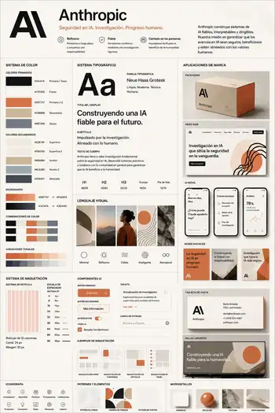

# Anthropic-style 品牌 / UI 视觉系统拆解（2026-10-05）

> 来源说明：本案例来自用户提供的视觉规范参考图。它被视为“适用于 Anthropic 风格的品牌/UI 参考板”，**未验证为 Anthropic 官方、完整或当前版本的设计系统**。本案例用于视觉方法学习，不用于声明官方规范。



> 仓库中的图片为便于版本管理而压缩的 WebP 参考副本；分析以用户提供的原始图片为视觉依据。

## 1. 可见观察

### 1.1 品牌语义

顶部信息将品牌性格组织为几个明确方向：

- Reflective / Reflexivo：长期思考、负责任。
- Reliable / Fiable：研究驱动、建立信任。
- Human-centered / Centrado en las personas：强调人类利益和可理解性。
- 整体文案将“AI 安全、研究、人类进步”放在同一语义场中。

值得学习的不是文案本身，而是：**先把品牌性格写清楚，再让视觉系统承担这些性格。**

### 1.2 色彩系统

参考板使用大面积暖白与近黑建立基础秩序，再用陶土橙、米色、灰蓝做低饱和扩展。

板面标注的示例色值包括：

| 角色 | 板面标注 |
| --- | --- |
| Primary / Text | `#1A1A1A` |
| Background | `#F5F2ED` |
| Primary / UI | `#D97757` |
| Secondary | `#C9B89B` |
| Support | `#6B7280` |
| Surface | `#EDE7DE` |
| Surface 2 | `#F0EDE9` |
| Accent | `#B8A88A` |
| Accent 2 | `#8CA3B0` |
| Muted | `#3D4451` |

观察重点：

- 主背景不是纯白，而是带温度的暖白。
- 强调色不是高纯度科技蓝，而是陶土 / 赤陶方向。
- 辅助色整体低饱和，形成“研究 / 编辑 / 材质”气质。
- 色彩组合中反复出现“黑—暖白—陶土—灰蓝”的节奏。

这些色值只记录参考板事实，**不作为我们自己的固定色板**。

### 1.3 字体与信息层级

板面标注字体为 Neue Haas Grotesk，并描述为“clean / modern / technical / human”。

展示出的字号尺度：

- H1：48/56
- H2：32/40
- H3：24/32
- Body：16/24
- Caption：12/16

真正有价值的不是指定字体，而是它同时承担了两种角色：

- 大标题有明显编辑排版感。
- 正文和 UI 又保持产品级可读性。

### 1.4 栅格与 spacing

参考板可见：

- 12 栏栅格。
- gutter / channel 约 24 px。
- margin 约 32 px。
- spacing scale：4 / 8 / 16 / 24 / 32 / 48 / 64 / 80 / 96 px。

它说明视觉秩序不是靠“感觉对齐”，而是通过有限的空间令牌复用。

### 1.5 视觉语言

影像与图形素材集中在：

- 建筑空间。
- 山景 / 天空。
- 人物肖像。
- 岩石、纸张等物理材质。
- 橙色圆形、波纹线、点阵、几何切片。

板面给出的视觉关键词可归纳为：

- Minimal
- Reflective
- Warm
- Intelligent
- Timeless

它们共同指向一个很有价值的科技品牌命题：

> **技术可信度不一定依赖“未来感”；也可以通过研究感、编辑感与物质性建立。**

### 1.6 UI 组件

可见组件包括：

- Primary / Secondary button。
- Toggle。
- Checkbox。
- Card。
- Input。
- Hero / Feature / Article / Panel 等布局示例。
- 单线条图标系统。

组件处理整体克制：轻边框、少量强调色、弱阴影、留白充足。

### 1.7 跨媒介应用

参考板把同一套 DNA 应用到：

- Packaging。
- Hero web。
- Mobile UI。
- Social posts。
- Business card。
- Billboard / advertisement。

这里最重要的观察是：不同媒介没有复制同一版式，但色彩、字体、形状、影像与语气保持一致。

## 2. 意境与设计解释

这套系统的真正核心不是“米白 + 橙色”，而是四组耦合关系：

1. **理性网格 × 温暖材质**
2. **中性基底 × 小面积主动强调色**
3. **编辑层级 × 产品可用性**
4. **抽象智能 × 现实中的人和自然**

这四组关系共同建立了一种可以称为 **Humanist Research Tech｜人本研究型科技** 的视觉性格。

它回避两种常见模板：

- “科技 = 蓝紫霓虹 + 玻璃拟态 + 发光线条”。
- “人本 = 柔软圆角 + 糖果色 + 生活方式插画”。

因此它显得成熟：视觉表达没有试图证明“我很像 AI”，而是在证明“我是一个可信、理性、与现实世界有关的研究组织”。

## 3. 可迁移假设

<a id="transferable"></a>

### 假设 A：品牌语义应先于 UI token

```text
Brand Semantics
→ Visual Contrasts
→ Foundation Tokens
→ Component Grammar
→ Cross-medium Adaptation
```

如果直接从颜色与按钮开始，容易得到漂亮但没有品牌理由的界面。

### 假设 B：研究型科技感可以由“理性 × 温度”建立

技术可信度主要来自秩序、层级、精确和一致性；人的温度来自色温、材质、现实影像和语气。两者叠加，比单纯堆“未来科技元素”更耐久。

### 假设 C：强调色越少，越有行动权重

中性面积越稳定，小面积品牌色越能承担 CTA、选中与视觉锚点。把品牌色铺满页面会削弱它的注意力价值。

### 假设 D：跨媒介统一来自视觉语法

真正要复用的是：

- 颜色角色。
- 字体层级。
- 栅格规则。
- 图形母题。
- 影像选择。
- 组件性格。

不是把网站 Hero 缩小后放进社交媒体，也不是把海报直接切成移动端界面。

### 假设 E：物理材质能降低 AI 品牌的“无实体感”

纸张、石材、陶、建筑和人物让抽象技术重新连接到真实世界，有助于形成“研究机构 / 产品公司 / 人类社会”之间的连续性。

## 4. 取其精华

值得沉淀为方法：

- **品牌价值 → 视觉关系**，而不是 slogan 与 UI 各自独立。
- **理性结构 × 人的温度**作为核心张力。
- 低饱和中性底承载内容，小面积暖色承担行动。
- 编辑排版与产品可读性共用一套字体层级。
- 栅格与 spacing token 建立可扩展秩序。
- 影像、材质、抽象图形形成统一素材家族。
- 多媒介共享 DNA，但允许构图和信息密度变化。
- 技术品牌不必依赖赛博未来主义。

## 5. 去其糟粕 / 需要补全

参考板作为 moodboard / brand board 很完整，但如果直接当作产品 Design System，还存在明显缺口。

### 5.1 不复制品牌专属资产

不能直接继承：

- Anthropic / AI 字标和专属符号。
- 精确配色。
- 营销文案。
- 专属图形母题。
- 指定商业字体。

我们要复制的是“关系逻辑”，不是“品牌词汇”。

### 5.2 交互状态不完整

产品级规范还需要：

- Hover
- Active / Pressed
- Focus
- Disabled
- Loading
- Validation / Error

### 5.3 无障碍未展示

暖色、米色在暖白背景上用于小字号文本时可能对比不足。真实产品必须做 WCAG 对比度验证，而不是凭肉眼判断。

### 5.4 响应式与高密度场景缺失

参考板偏品牌展示与营销页面，没有充分说明：

- 移动端断点。
- 企业级高密度表格。
- 数据可视化。
- 多语言与中文排版。
- 深色模式。
- 动效规则。

### 5.5 容易形成新的“AI 品牌同质化”

暖白、土色、极简无衬线正在成为常见的高级科技品牌语汇。若没有一个真正可拥有的视觉锚点，最终仍可能“高级但无辨识度”。

## 6. 对我们的知识库的结论

这张参考图最值得保留的一句话是：

> **学语法，不抄词汇。**

对应的方法文档：

- [品牌到 UI：人本研究型科技视觉系统](../methods/brand-ui-visual-system.md)

当前证据只有这一张参考板，因此方法与案例都保持 `experimental`。后续若在至少 3 个独立品牌 / 产品案例中验证“品牌语义 → 视觉对比 → token → 组件 → 跨媒介”的链条，再考虑升级状态。
